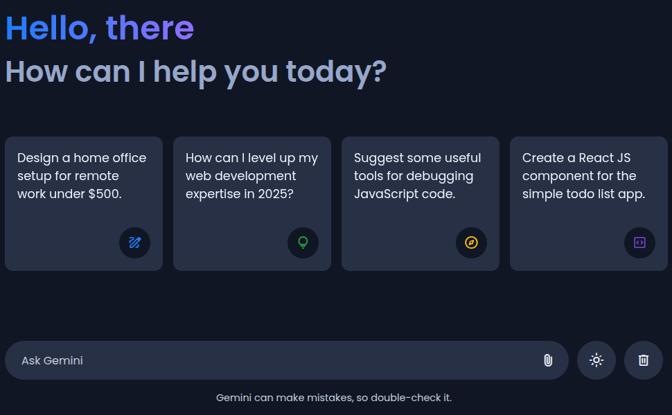
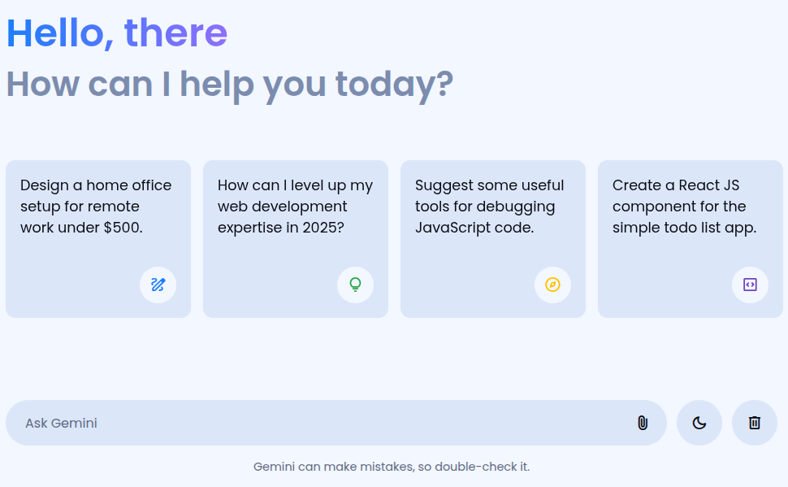

<h1 align="center">Gemini Clone</h1>

  

## About The Project
This project is a custom-built lightweight clone of Google's Gemini AI assistant. It allows users to interact with an AI through an API key obtained from Google's AI Studio.

### Built With

### Features
- Responsive and modern UI
- Dark/light mode toggle
- File input
- Prompt suggestions

  
  
